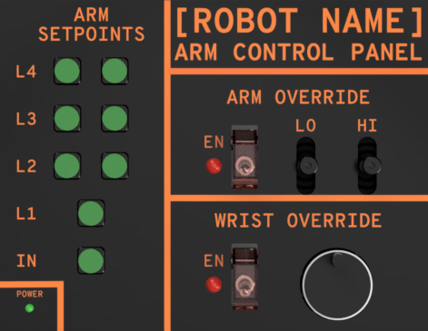

# TigerPad Pin Connections

## Raspberry Pi Pico Pinout

\
***Source:** [Pico documentation](https://www.raspberrypi.com/documentation/microcontrollers/pico-series.html#pico-1-family)*

## TigerPad Mockup

### Pico Connections

| Pin | Label |     Function    | USB Type[^1] |
|:---:|:-----:|:---------------:|:------------:|
|  1  |  GP0  |      IN_BTN     |     INPUT    |
|  2  |  GP1  |      IN_LED     |    OUTPUT    |
|  4  |  GP2  |      L1_BTN     |     INPUT    |
|  5  |  GP3  |      L1_LED     |    OUTPUT    |
|  6  |  GP4  |     L2L_BTN     |     INPUT    |
|  7  |  GP5  |     L2L_LED     |    OUTPUT    |
|  9  |  GP6  |     L2R_BTN     |     INPUT    |
|  10 |  GP7  |     L2R_LED     |    OUTPUT    |
|  11 |  GP8  |     L3L_BTN     |     INPUT    |
|  12 |  GP9  |     L3L_LED     |    OUTPUT    |
|  14 |  GP10 |     L3R_BTN     |     INPUT    |
|  15 |  GP11 |     L3R_LED     |    OUTPUT    |
|  16 |  GP12 |     L4L_BTN     |     INPUT    |
|  17 |  GP13 |     L4L_LED     |    OUTPUT    |
|  19 |  GP14 |     L4R_BTN     |     INPUT    |
|  20 |  GP15 |     L4R_LED     |    OUTPUT    |
|  21 |  GP16 |    ARM_EN_SW    |     INPUT    |
|  22 |  GP17 |   WRIST_EN_SW   |     INPUT    |
|  24 |  GP18 |   WRIST_ROT_A   |   INPUT[^2]  |
|  25 |  GP19 |   WRIST_ROT_B   |   INPUT[^2]  |
|  26 |  GP20 |                 |              |
|  27 |  GP21 |                 |              |
|  29 |  GP22 |   FWUP_BTN[^3]  |              |
|  31 |  GP26 |      ARM_LO     |     INPUT    |
|  32 |  GP27 |      ARM_HI     |     INPUT    |
|  34 |  GP28 | WRIST_PIVOT[^4] |     INPUT    |

**NOTE: WRIST_ROT_A and WRIST_ROT_B need to be moved to an external ADC**

[^1]: In the USB HID spec, input and output are relative to the host device (i.e. the computer) the USB device is plugged into

[^2]: Rotary encoder inputs A and B are combined to calculate a single USB input

[^3]: This is a hidden button used to put the microcontroller into firmware update mode

[^4]: This joystick is not present in the mockup
